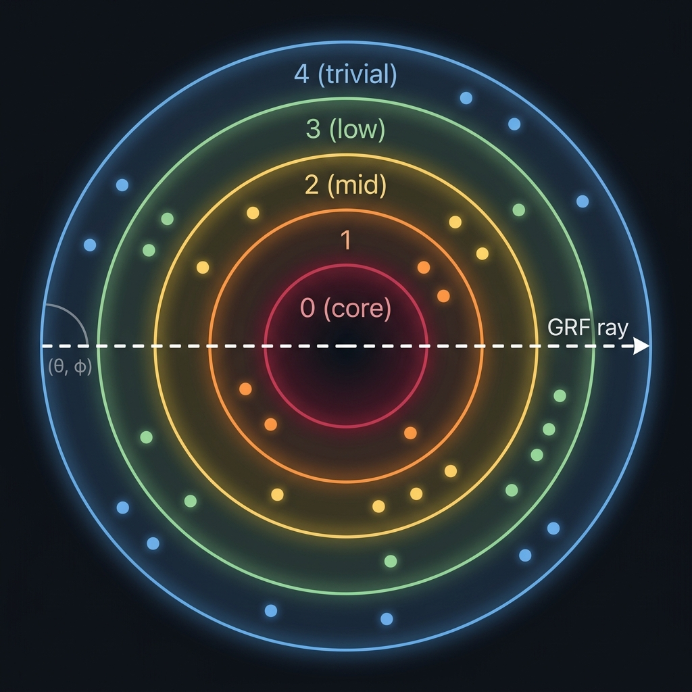

# 🧅 OnionDB

[](https://pypi.org/project/oniondb/)
[](LICENSE)
[](https://pypi.org/project/oniondb/)
[]()

**A geometric database. Zero dependencies. Importance-stratified.**

Your data has a *location*, not just a vector.

*Originally developed for the AIGalaxy cognitive memory field; extracted for standalone use.*

---

OnionDB organizes data in concentric shells -- like layers of an onion. Every record has a 4-part geometric address `(gap, theta, phi, depth)` based on its importance and semantic content. This enables queries that flat vector databases can't do:

- **"Show me everything at importance level 3"** --> shell scan
- **"Drill through ALL importance levels at this semantic direction"** --> GRF (Geometric Ray Filter)
- **"Trace how this topic connects across depth levels"** --> reverse ray

<p align="center">
  
</p>

## Install

```bash
pip install oniondb            # zero dependencies
pip install oniondb[fast]      # optional numpy acceleration (~10x cosine speed)
```

## Quick Start

```python
from oniondb import OnionDB

# Create a database (SQLite file, zero config)
db = OnionDB("my_data.db")

# Insert with importance (determines which shell)
db.insert("idea-1", "The Earth orbits the Sun", importance=0.9)
db.insert("idea-2", "I had coffee this morning", importance=0.3)
db.insert("idea-3", "E=mc2 defines mass-energy equivalence", importance=0.99)

# Shell scan -- everything at importance level 0 (core records)
core = db.shell_scan(gap=0)

# GRF -- drill through ALL shells at a direction
# (requires embeddings for semantic direction)
profile = db.grf(theta=45.0, phi=10.0, query_embedding=my_embedding)

# Reverse ray -- follow semantic gravity inward
trace = db.reverse_ray(start_embedding=my_embedding)
print(f"Path curvature: {trace['curvature']} degrees")  # 0=straight, high=fragmented

# Beam search -- explore multiple paths (default: greedy)
trace = db.reverse_ray(start_embedding=my_embedding, beam_width=3)

# Count, get, delete
print(db.count())        # 3
print(db.get("idea-1"))  # full record dict
db.delete("idea-2")      # True
```

## Features

| Feature                  | Description                                                            |
|--------------------------|------------------------------------------------------------------------|
| **Zero dependencies**    | stdlib only -- `sqlite3`, `math`, `struct`, `json`, `os`              |
| **Numpy acceleration**   | Optional `oniondb[fast]` -- ~10x cosine, ~5x decode. Auto-detected    |
| **Geometric addressing** | Every record has a location: `(gap, theta, phi, depth)`               |
| **Importance shells**    | Data stratified by significance -- core vs trivial                    |
| **6 query operations**   | horizontal, GRF, reverse_ray, temporal_grf, shell_scan, range_scan    |
| **Beam search**          | `reverse_ray(beam_width=3)` explores multiple paths simultaneously    |
| **Configurable grid**    | `OnionDB(theta_cells=24, phi_cells=12)` for custom resolution         |
| **CLI inspector**        | `python -m oniondb stats mydb.db` -- inspect databases from terminal  |
| **Embedding-agnostic**   | Works with any embedding model (OpenAI, Ollama, sentence-transformers)|
| **Single-file storage**  | SQLite-backed, portable, copy-paste deployable                        |
| **Self-calibrating**     | `fit_projection()` builds PCA from your data automatically            |
| **Thread-safe**          | RLock + WAL mode for concurrent access                                |

## Use Cases

### 🤖 AI Agent Memory & RAG

AI agents accumulate knowledge of varying importance — core instructions, learned facts, recent conversations, and trivial observations. Traditional RAG retrieves by semantic similarity alone, burying low-importance context that might be critical. OnionDB's GRF drills through all importance levels at once, giving the agent a **full depth profile** instead of just the top-scoring matches.

### 📊 Log Analysis & Incident Response

Logs have natural severity tiers: CRITICAL → WARNING → INFO → DEBUG. When investigating "database timeout", you need related events at **every severity level**, not just the most similar log lines. A GRF through severity shells gives instant cross-severity triage — from the crash trace down to the debug message that reveals root cause.

### 📚 Knowledge Management

Corporate wikis, Obsidian vaults, and research notebooks contain documents of wildly different importance — foundational architecture docs, recent meeting notes, quick ideas. OnionDB ensures a search for "authentication" surfaces both the core security spec **and** the meeting note where someone mentioned a workaround.

### 🎬 Content Recommendation

Streaming platforms and e-commerce stores have content tiers: blockbusters vs. indie, bestsellers vs. clearance. Standard recommenders favor popular items. OnionDB can drill across popularity shells to deliver **diverse recommendations** — a mix of mainstream hits and hidden gems at the same semantic direction.

### 🔬 Research & Literature Review

Academic papers have inherent importance gradients — landmark papers with 10,000 citations vs. niche studies with 12. When researching a topic, flat search always surfaces the famous papers. A GRF finds both the seminal work **and** the obscure paper with a unique angle that flat retrieval buries on page 5.

### 🏥 Medical Records

Patient histories span critical diagnoses, routine checkups, and minor notes. When a doctor searches "chest pain", they need everything — from the cardiac event to the annual physical that noted mild discomfort. Importance-stratified retrieval ensures **nothing clinically relevant is hidden** by more "prominent" records.

---

> **The common thread:** anywhere data has inherent importance tiers and you need retrieval across all tiers simultaneously. Flat search favors the "loudest" matches. OnionDB gives you the full depth profile.
## The Signature Query: GRF (Geometric Ray Filter)

The GRF is what makes OnionDB unique. It "drills a core sample" through every importance shell at a given semantic direction, returning a **depth profile** of how a topic exists at every level of significance.

```python
# With embeddings: semantic direction from the embedding
profile = db.grf(theta=0, phi=0, query_embedding=embedding, k_per_gap=5)
# Returns: {0: [core records], 1: [important], 2: [mid], 3: [low], 4: [trivial]}

# The reverse ray follows semantic gravity inward, bending as it goes
trace = db.reverse_ray(start_embedding=embedding)
# trace["curvature"] -- total angular deviation
# trace["straight"]  -- True if topic is well-organized across all depths
# trace["path"]      -- list of hops from outer to inner shells
```

## Using with Embeddings

OnionDB works with or without embeddings. Without them, queries use angular distance. With them, queries use cosine similarity for precise semantic ranking.

```python
# Any embedding model works -- just pass a list of floats
from sentence_transformers import SentenceTransformer
model = SentenceTransformer("all-MiniLM-L6-v2")

embedding = model.encode("quantum physics").tolist()
db.insert("q1", "Quantum entanglement is spooky", importance=0.8, embedding=embedding)

# After inserting enough data, calibrate the projection
stats = db.fit_projection()
print(f"Cell occupancy: {stats['occupancy_after']:.0%}")  # target: >80%
```

## API Reference

### Core Operations

| Method                                 | Description                                          |
|----------------------------------------|------------------------------------------------------|
| `insert(id, content, importance, ...)` | Insert a record with auto-computed geometric address |
| `get(id)`                              | Retrieve a record by ID                              |
| `delete(id)`                           | Delete a record by ID                                |
| `count(gap=None)`                      | Count records (optionally per gap)                   |
| `batch_insert(items)`                  | Insert multiple records in a single transaction      |

### Query Operations

| Method                                  | Description                                          |
|-----------------------------------------|------------------------------------------------------|
| `horizontal(gap, theta, phi, ...)`      | Find nearby items within one shell                   |
| `grf(theta, phi, ...)`                  | **Geometric Ray Filter** -- drill through all shells |
| `reverse_ray(start_embedding, ...)`     | Curved semantic trace from outer to inner            |
| `temporal_grf(theta, phi, ...)`         | Drill through time-based shells                      |
| `shell_scan(gap, limit)`                | Return everything at one importance level            |
| `range_scan(gap_start, gap_end, limit)` | Return everything between two levels                 |

### Configuration

| Method                      | Description                                     |
|-----------------------------|--------------------------------------------------|
| `fit_projection(save=True)` | Self-calibrate PCA from stored embeddings        |
| `fit_boundaries(n_gaps=5)`  | Suggest quantile-based boundaries from data      |
| `reindex(boundaries=None)`  | Recalculate all gap/depth/cell assignments       |
| `stats()`                   | Database statistics (gaps, categories, grid)     |
| `cell_density(gap)`         | Cell occupancy map for a gap                     |

### Constructor Options

```python
# Default: 5 shells, 12×6 grid
db = OnionDB("custom.db", boundaries=[0.90, 0.70, 0.40, 0.00])  # 4 shells

# Higher grid resolution for larger datasets (default: 12×6 = 72 cells)
db = OnionDB("large.db", theta_cells=24, phi_cells=12)  # 288 cells
```

### CLI Inspector

```bash
python -m oniondb stats mydb.db       # database statistics
python -m oniondb info mydb.db        # file size, PCA status, numpy detection
python -m oniondb density mydb.db     # cell occupancy map for gap 0
python -m oniondb shell mydb.db       # show records in gap 0
```

## How It Works

1. **Importance to Gap**: Each record's importance score determines which shell (gap) it lives in. Gap 0 is the innermost core (most important).

2. **Embedding to Angles**: If an embedding is provided, PCA projects it onto spherical coordinates (theta, phi). This gives semantically similar items nearby angular positions.

3. **Address**: Every record gets a 4-part address: `(gap, theta, phi, depth)` where depth is the position within the gap based on exact importance.

4. **Cells**: 72 cells via 12×6 latitude/longitude grid (naive partition, not equal-area). Polar cell compression is mitigated by PCA linear rescaling. Configurable via `THETA_CELLS` and `PHI_CELLS` class attributes. Queries search the target cell plus neighbors for efficiency.

## Technical Details

### PCA Projection — how embeddings become coordinates

OnionDB does **not** use raw embedding dimensions as angles. That would produce clustered, unevenly distributed coordinates (our v0 prototype only achieved 29% cell occupancy).

Instead, `fit_projection()` computes a data-driven PCA (Principal Component Analysis) from all stored embeddings:

1. **Center** all embeddings by subtracting the mean — removes magnitude bias
2. **Extract** the two directions of maximum variance (PC1, PC2) using power iteration
3. **Project** each embedding onto PC1 → theta, PC2 → phi
4. **Linearly rescale** using stored min/max ranges to fill [-180°, 180°] × [-90°, 90°]

Result: **88% cell occupancy** (vs 29% with naive projection), and **93% recall@10** in leave-one-out benchmarks (baseline v0 projection: 68%). This metric measures **projection quality** — how well the PCA mapping preserves semantic neighborhoods on the sphere.

```python
# After inserting enough data, calibrate once:
stats = db.fit_projection()
# Saves pca_projection.json next to your .db file
# All future inserts and queries use the learned projection
```

### GRF — not just cosine search

A common first impression: "GRF is just cosine similarity with extra steps." Here's what actually happens:

1. **Cell partitioning** — the query direction (θ, φ) maps to a grid cell. SQL filters to that cell + neighbors only (`WHERE (cell_theta, cell_phi) IN (...)`). This is a spatial index, not a full scan.
2. **Per-shell execution** — GRF runs this search independently in **each importance shell**. A flat vector DB returns the top-k globally; GRF returns top-k **per importance level**.
3. **Cosine ranking** — within each cell partition, candidates are ranked by cosine similarity to the query embedding. Cosine is the ranking metric, not the search mechanism.

The result: records that a flat database buries (because they're "low importance" and score lower globally) appear naturally in their respective shells.

### Reverse Ray — the gravity kernel

The reverse ray traces a path from outer shells inward. The "gravity" that pulls the ray is **greedy cosine similarity with position inheritance**:

1. Start at the outermost shell. Find the best cosine match to the query embedding.
2. Take that match's (θ, φ) position as the new search direction.
3. Move one shell inward. Search again from the new direction.
4. Repeat until reaching the core (gap 0).

At each hop, the ray **bends** — it follows where semantic similarity leads, not a fixed direction. The accumulated angular deviation between hops is the **curvature**.

### Curvature — what it measures

Curvature is the total angular deviation between consecutive hops of a reverse ray. It's measured in degrees.

- **Low curvature** (< 15°) → topic is **coherently organized** across all importance levels. The same semantic cluster exists at every depth.
- **High curvature** (> 45°) → topic is **fragmented**. Related content exists at different importance levels but in different semantic neighborhoods.

This is diagnostic information that flat vector search literally cannot produce. It tells you about the **topology** of your data on a given topic.

```python
trace = db.reverse_ray(start_embedding=query_emb)
if trace["straight"]:
    print("Knowledge is well-organized across all depths")
else:
    print(f"Fragmented: {trace['curvature']}° total deviation over {trace['n_hops']} hops")
```

### Embedding model consistency

**All records must use the same embedding model.** PCA projection is fitted on a specific embedding space. Mixing models (e.g., inserting with `all-MiniLM-L6-v2` and querying with `text-embedding-ada-002`) produces meaningless coordinates.

This is not OnionDB-specific — it's a universal constraint of all embedding-based databases. OnionDB simply makes it explicit.

## Scaling

OnionDB uses a **72-cell grid per shell** (12 theta × 6 phi divisions). Queries only scan the target cell and its neighbors (~9 cells), not the entire database. This means query time grows with cell density, not total record count.

| Records | Avg per cell | GRF performance | Verdict          |
|---------|--------------|-----------------|------------------|
| 1K      |  ~3          | instant         | ✅ no sweat       |
| 10K     |  ~28         | instant         | ✅ smooth         |
| 100K    |  ~280        | fast            | ✅ solid          |
| 500K    |  ~1,400      | noticeable      | ⚠️ still usable   |
| 1M+     |  ~2,800+     | slowing down    | ❌ consider alternatives |

### What limits scaling

- **Cosine similarity** — without numpy, each candidate requires a pure Python dot product. Install `oniondb[fast]` for ~10x speedup.
- **`fit_projection()`** — reads all embeddings to compute PCA. This is O(n) and will be slow at millions of records.
- **SQLite single-writer** — concurrent writes are serialized. Reads are concurrent via WAL mode.

### What helps

- **Numpy acceleration** — `pip install oniondb[fast]` uses `np.dot` and `np.frombuffer` for the hot path. ~10x faster cosine, ~5x faster BLOB decoding.
- **Configurable grid** — `OnionDB(theta_cells=24, phi_cells=12)` creates 288 cells instead of 72, halving per-cell density for large datasets.
- The grid **partitions** the search space — you're always scanning ~1/72 of each shell (or less with higher resolution), not everything.
- **Shell structure** naturally distributes data — most real datasets have more trivial records than core ones, spreading load across gaps.
- For datasets beyond 500K, you can use OnionDB as a **complementary index** alongside FAISS/pgvector for the raw ANN search.

> **OnionDB is designed for human-scale datasets** (up to ~500K records) where importance stratification matters more than raw vector throughput. It doesn't compete with FAISS at 100M scale — it solves a different problem.

## Comparison

|                      | OnionDB       | FAISS        | ChromaDB      | Pinecone      | pgvector   |
|----------------------|---------------|--------------|---------------|---------------|------------|
| Dependencies         |    **0**      |   numpy      |    many       |  cloud SDK    | PostgreSQL |
| Importance hierarchy |  **native**   |    no        |     no        | metadata only |     no     |
| Geometric queries    | **GRF, ray**  |    no        |     no        |      no       |     no     |
| Storage              |  SQLite file  | memory/file  |   SQLite      |    cloud      |   server   |
| Setup                | `pip install` | `pip install`| `pip install` |   API key     |  DB server |

## Benchmark: OnionDB vs Flat Vector Search

We ran a head-to-head A/B comparison against a traditional flat vector database (semantic search + FTS5 hybrid) on a production dataset of **1,600+ embedded records** from an AI agent's knowledge base -- spanning hardware docs, software architecture, research notes, session logs, and personal knowledge.

### Results

| Metric              | Flat Vector DB | OnionDB          |
|---------------------|----------------|------------------|
| Avg query latency   | 8,024ms        | **541ms**        |
| Speed               | 1x             | **14.8x faster** |
| Avg Jaccard overlap | --             | **7%**           |

**93% of results are unique to OnionDB** (Jaccard overlap = 7%) — meaning the flat database missed them entirely. This is a **diversity metric**: OnionDB surfaces records that flat search buries because they're at lower importance levels. Different from recall@10 above, which measures projection quality.

### Per-query detail (15 queries across diverse topics)

| Query topic                 | Overlap | Shared | Unique to OnionDB |
|-----------------------------|---------|--------|-------------------|
| Hardware specs              |   0%    |   0    |        10         |
| System architecture         |   0%    |   0    |        10         |
| Game simulation             |   0%    |   0    |        10         |
| Inter-process communication |  18%    |   3    |         7         |
| ML embeddings               |   5%    |   1    |         9         |
| OS configuration            |   0%    |   0    |        10         |
| Database internals          |  11%    |   2    |         8         |
| Error handling              |   5%    |   1    |         9         |
| Optimization algorithms     |   5%    |   1    |         9         |
| Protocol design             |   0%    |   0    |        10         |
| Networking                  |  25%    |   4    |         6         |
| Model retraining            |   0%    |   0    |        10         |
| Math/geometry               |  25%    |   4    |         6         |
| System monitoring           |   0%    |   0    |        10         |
| Data consolidation          |  11%    |   2    |         8         |

### Why the difference?

Flat vector databases rank by cosine similarity alone. OnionDB's geometric structure means records at different importance levels get equal representation through the GRF drill. A "trivial" record that's semantically close can appear alongside a "core" record on the same topic -- something flat search buries under higher-scored results.

**Verdict: OnionDB doesn't replace flat search -- it surfaces what flat search misses.**

## License

MIT -- do whatever you want with it.